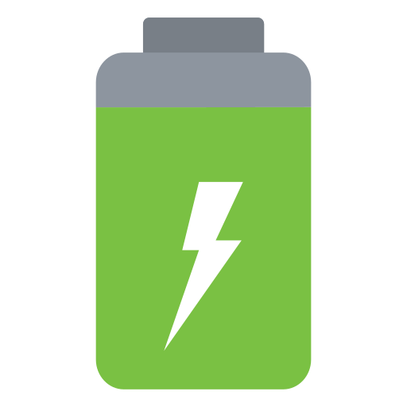
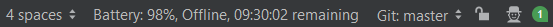

<h1 align="center">
     
    Battery Status
</h1>

        
        
        
        
         
IntelliJ IDEA (and other JetBrains products) plugin that displays battery status in the Status Bar.

Usage:

* Windows: plugin should work as it.
* Linux: you must be able to invoke `acpi -b`. Be sure ACPI is installed: on Debian or Ubuntu, type `sudo apt install acpi`.
* MacOS: plugin should work as it. You must be able to invoke `pmset -g batt`.

Battery status is updated every 90 seconds, configurable in <kbd>File</kbd>, <kbd>Settings...</kbd>, <kbd>Tools</kbd>, <kbd>Battery Status</kbd>.

## Build

Install a JDK8+ and Gradle, then run `./gradlew buildPlugin verifyPlugin`. See the ZIP file generated in `build/distributions/`.  
You can also run plugin in a standalone IDE with `./gradlew runIde`. 

## Author

Jonathan Lermitage (<jonathan.lermitage@gmail.com>)  
Linkedin profile: [jonathan-lermitage-092711142](https://www.linkedin.com/in/jonathan-lermitage-092711142/)

## License

MIT License. In other words, you can do what you want: this project is entirely OpenSource, Free and Gratis.
