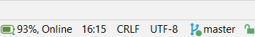

<h1 align="center">
    
     
    Battery Status
</h1>

    
    
    
     
An open-source and free IntelliJ IDEA (and other JetBrains IDEs) plugin that displays battery status in the Status Bar.

  

Usage:

* Windows: plugin should work as it.
* Linux: you must be able to invoke `acpi -b`. Be sure ACPI is installed: on Debian or Ubuntu, type `sudo apt install acpi`.
* MacOS: plugin should work as it. You must be able to invoke `pmset -g batt`.

Otherwise, go to plugin's settings and choose to use Oshi in order to get battery status. This is more configurable, it seems to work everywhere (macOS users may appreciate), but the battery information may differ a little bit from what you get from the operating system. Per example, on Windows, Oshi may indicate a *remaining time* (when charging or discharging) that differs from the Power Options indicator in the Windows status bar. Without Oshi, on Windows, plugin will query the native `Kernel32.SYSTEM_POWER_STATUS`, which is exactly what you get from the Power Options indicator. Oshi information are not wrong, but some of them simply offer estimates based on different calculation methods. You may observe the same thing on Linux (Oshi vs `acpi -b`) and macOS (Oshi vs `pmset -g batt`).

Battery status is updated every 90 seconds, configurable in <kbd>File</kbd>, <kbd>Settings...</kbd>, <kbd>Appearance</kbd>, <kbd>Battery Status</kbd>.

## Build

Install a JDK17+ and Gradle, then run `./gradlew buildPlugin`. See the ZIP file generated in `build/distributions/`.  
You can also run plugin in a standalone IDE with `./gradlew runIde`.

You can also take a look at the [Makefile](Makefile).

## Author

Jonathan Lermitage (<jonathan.lermitage@gmail.com>)  
Linkedin profile: [jonathan-lermitage](https://www.linkedin.com/in/jonathan-lermitage/)

## License

MIT License. In other words, you can do what you want: this project is entirely OpenSource, Free and Gratis.
